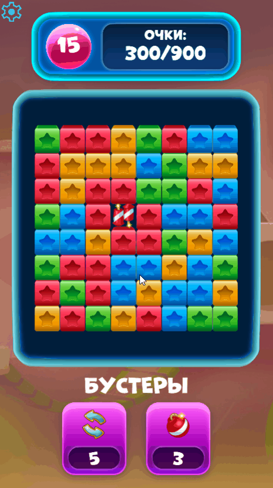

# Casual prototype of "Blast" game on Cocos Creator

[Русская версия](./README.ru.md)

A casual prototype of a puzzle game with Blast mechanics.

## 🚀 Demo
* **Play in browser (GitHub Pages):** https://Ne0Git.github.io/cocos-blast-prototype (Desktop and Mobile browsers are supported).

<div align="center">
  <a href="./docs/images/gameplay.gif" target="_blank">
    
  </a>
</div>

## 🛠️ Tech stack
* **Engine:** Cocos Creator 2.4.11
* **Language:** TypeScript
* **Tests:** Jest / ts-jest

## 📐 Architecture features
1. **Separated logic and visual:** All math (Flood Fill algorithm, grid collapse, score count) done on pure TypeScript. Inner logic separated from Cocos Creator, which allowed to add automated unit tests.
2. **Memory optimization (Object Pool):** To avoid Garbage Collector peaks and micro freezes on mobile platforms `cc.NodePool` is used.
3. **Level setup system (Data-Driven):** Level parameters are moved to JSON configuration files. Values for field size, available colors and win conditions are loaded dynamically through `LevelManager`. Implemented an "endless mode" where level configurations are picked randomly after list of predefined levels ends.
4. **Flexible combo system:** Conditions for spawn boosters are set up in editor through declarative array. Adding new types of boosters is available without core logic modification.

## 🕹️ Game Mechanics
* **Core loop:** Destroying groups of 2 blocks and more, blocks falling downward into empty spaces, spawn of new blocks, score and moves counting, popups for win or lose with possibility to continue or restart.
* **Booster "Bomb":** Activates from inventory. Remove blocks in radius R (sets up in editor).
* **Booster "Teleport":** Activates from inventory. Swap any two blocks on field.
* **Booster "Rocket":** Spawns on field. Automatically picks direction (vertical or horizontal) depending on destroyed group geometry. Destroys whole row or col.
* **Booster "Super bomb":** Spawns on field. Remove blocks in radius R (bigger radius assumed, sets up in editor).
* **Automatic field shuffle:** If there aren't any possible moves shuffles blocks on field up to 3 times (sets up in level config), then game over.

## 🔊 Audio system
Implemented `AudioManager` which supports mute and volume setup separately for music and SFX in options popup.

## 📜 Credits
* **Graphics:** provided by TapClap company.
* **Settings icon:** "settings" by Google Fonts Icons ([Apache License 2.0](https://www.apache.org/licenses/LICENSE-2.0)).
* **Music:** Acrostics by Cityfires ([CC-BY 3.0](https://creativecommons.org/licenses/by/3.0/legalcode.en)).
* **SFX:** The Essential Retro Video Game Sound Effects Collection [512 sounds] By [Juhani Junkala](https://www.youtube.com/watch?v=dbACpSy9FWY) ([CC0](https://creativecommons.org/publicdomain/zero/1.0/)).
* **Code:** Licensed under the [MIT License](./LICENSE).

## 💻 How to run project locally

> [!NOTE]
> To run locally and edit the project you need to install **Cocos Creator version 2.4.11**.

1. **Clone repository:**
   ```bash
   git clone https://github.com/Ne0Git/cocos-blast-prototype
   ```
2. **Open project:**
   * Launch Cocos Dashboard.
   * Press **Add** and choose directory with cloned repository.
3. **Run:**
   * Open `assets/scenes/Main.fire` scene in editor.
   * Press **Play** button on the top panel to launch game in browser.

## 🛠️ How to run tests locally
1. Install dependencies: `npm install`
2. Run Jest tests: `npm test`
